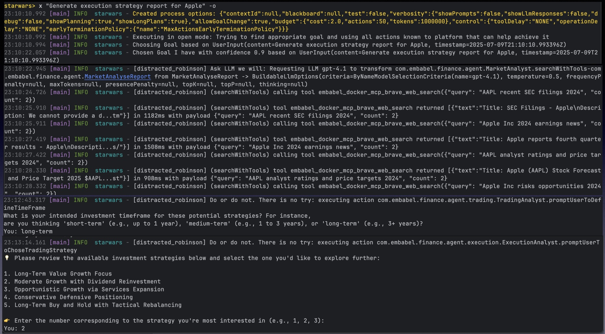

# Financial Advisor Agent

This project is a sophisticated, multi-agent system designed to provide personalized financial advice. It leverages the Embabel framework to create a conversational experience that guides users through the investment process, from initial research to generating a concrete trading plan.

## Features

*   **Conversational AI:** The agent uses a natural language interface to interact with users, making it easy to get started with financial analysis.
*   **Market Analysis:** The `MarketAnalyst` agent gathers and synthesizes real-time market data from the web, including news, SEC filings, and other relevant sources.
*   **Personalized Trading Strategies:** The `TradingAnalyst` agent works with users to understand their risk tolerance and investment goals, then generates tailored trading strategies.
*   **Actionable Execution Plans:** The `ExecutionAnalyst` agent creates detailed, step-by-step plans for implementing the chosen trading strategies.
*   **Multi-Agent System:** The project is built on a foundation of multiple, specialized agents that collaborate to provide a comprehensive financial analysis.

## How It Works

The Financial Advisor Agent is composed of three core agents:

1.  **Market Analyst:** This agent is responsible for conducting in-depth market research. When given a stock ticker, it scours the web for the latest information and compiles a detailed market analysis report.
2.  **Trading Analyst:** This agent takes the market analysis report and works with the user to create a personalized trading plan. It asks questions to determine the user's risk profile and investment horizon, then generates a `TradingReport` with a variety of suitable strategies.
3.  **Execution Analyst:** Once the user selects a strategy, this agent generates a `StrategyExecutionPlan`. This plan provides a clear, actionable guide to implementing the strategy, including entry and exit points, and risk management protocols.

## Getting Started

### Prerequisites

*   Java 21
*   Apache Maven

### Running the Application

1.  **Clone the repository:**
    ```bash
    git clone https://github.com/your-username/financial-advisor-agent.git
    cd financial-advisor-agent
    ```

2.  **Run the application:**
    ```bash
    ./scripts/shell.sh
    ```

This will start the Spring Boot application and launch the Embabel agent shell.

### Interacting with the Agent

Once the shell is running, you can interact with the agent using natural language commands. For example, to start a market analysis for a stock, you could use a command like:

```
x "Generate execution strategy report for nvidia" -o
```
Screenshots: 


Generated report : [nvidia-execution-plan.md](nvidia-execution-plan.md)

The agent will then guide you through the rest of the process, from defining your investment profile to generating a trading plan.

### Running with Ollama

To run the application with Ollama, you can use the following command:

```bash
mvn -U -f pom.xml -Dspring-boot.run.profiles=ollama -Dmaven.test.skip=true spring-boot:run
```

This will start the application with the `ollama` profile active, which is configured in the `src/main/resources/application-ollama.properties` file. You may need to update the properties in that file to match your Ollama setup.

## Technologies Used

*   **Embabel Agent Framework:** The core framework for building the multi-agent system.
*   **Spring Boot:** Provides the foundation for the application and dependency injection.
*   **Kotlin:** The primary programming language for the project.
*   **Java 21:** The underlying Java version.
*   **Apache Maven:** Used for project build and dependency management.
*   **OpenAI:** The agent uses OpenAI's language models to power its conversational AI and analysis capabilities.
*   **Spring Shell:** Provides the interactive command-line interface.